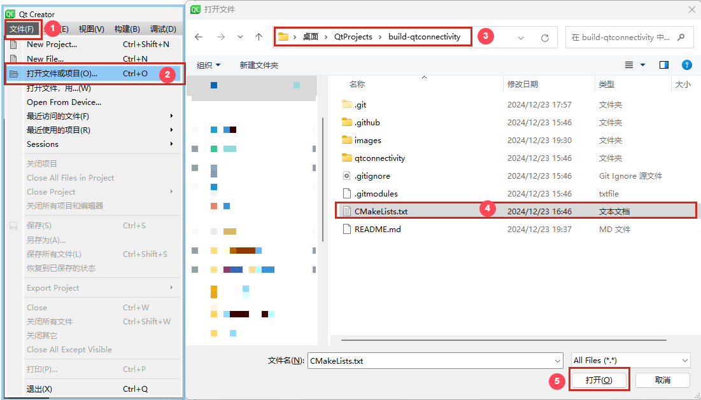
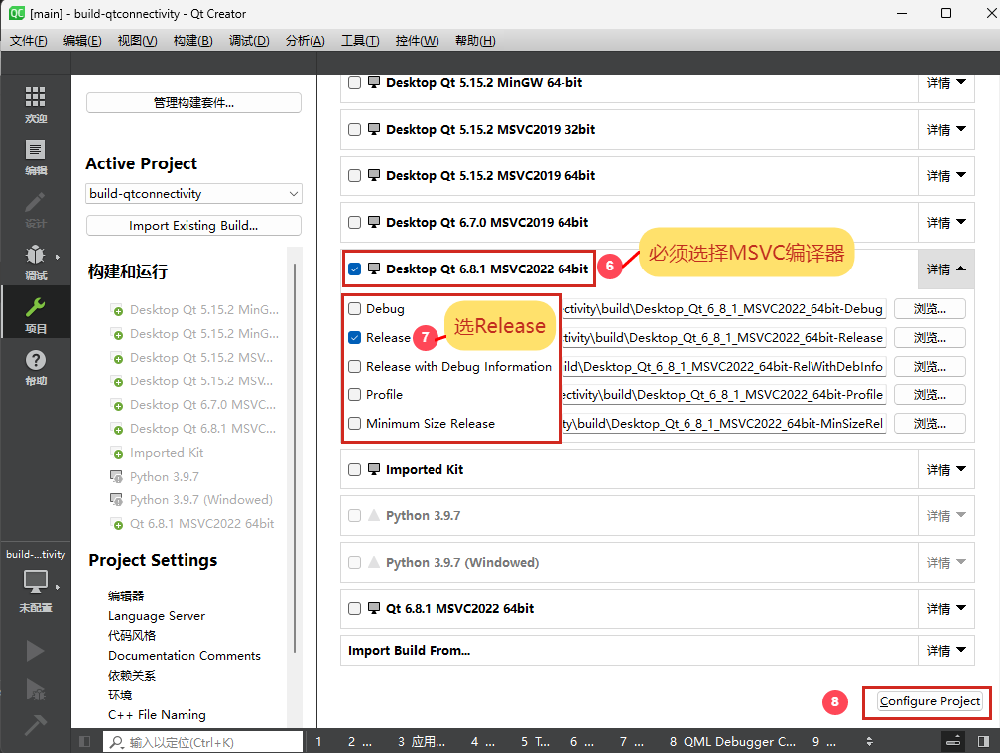
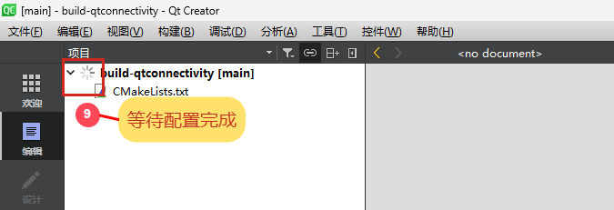
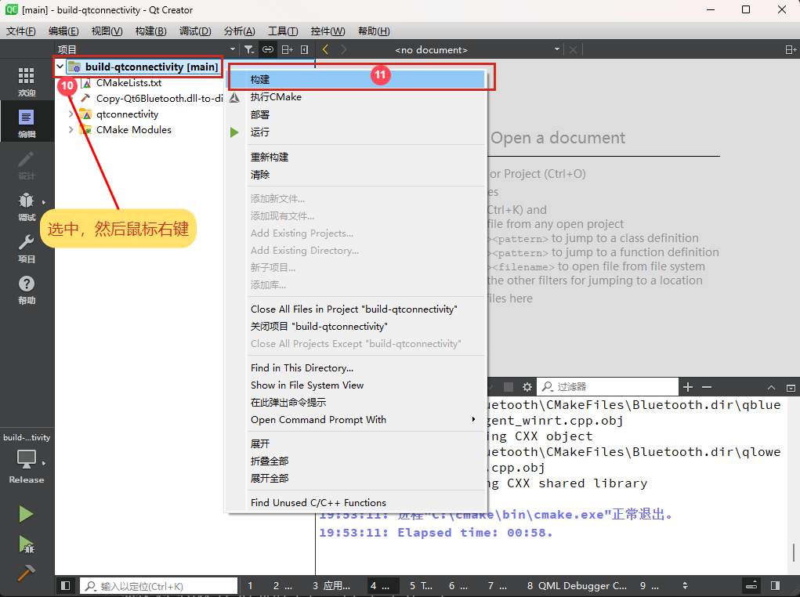
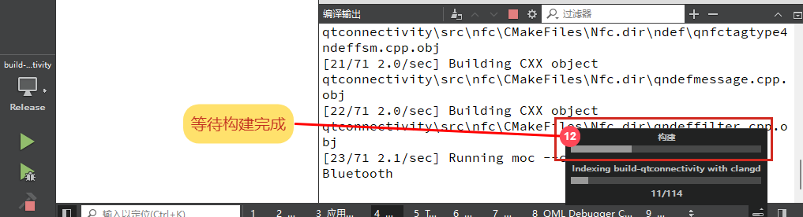
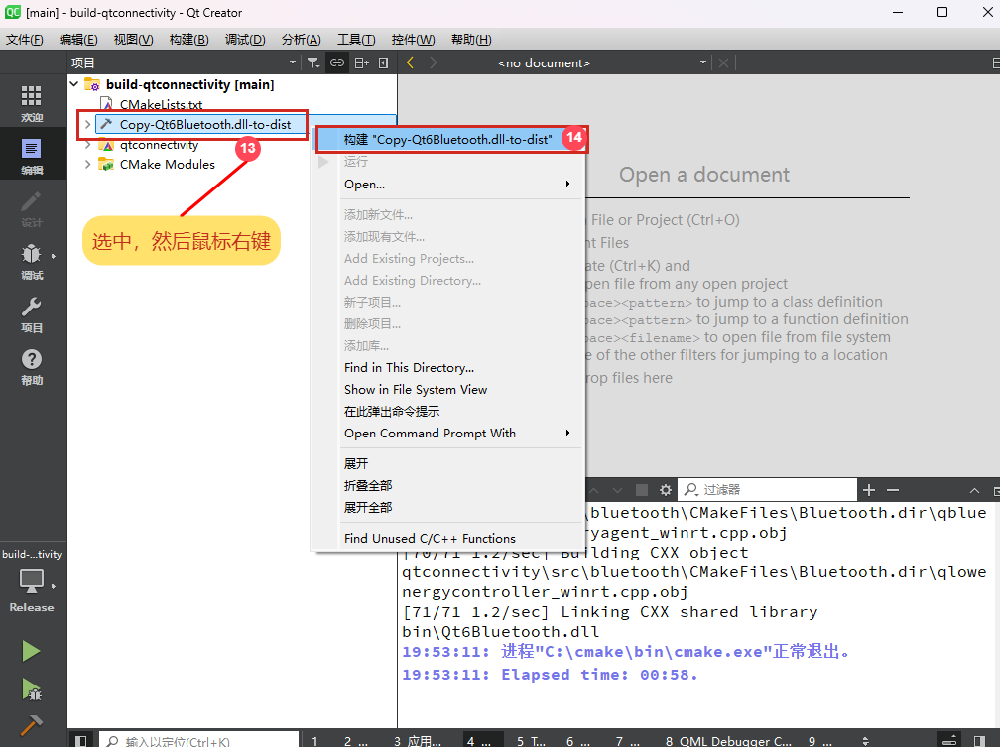
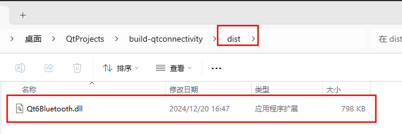

# build-qtconnectivity

## 说明

[qtconnectivity](https://github.com/qt/qtconnectivity) 的蓝牙模块在 Windows 平台下读取 CharacteristicUserDescription 会出现乱码 ([QTBUG-132202](https://bugreports.qt.io/browse/QTBUG-132202)), 
尝试对 [v6.8.1](https://github.com/qt/qtconnectivity/tree/v6.8.1) 进行了修复, 即 [fix-v6.8.1](https://github.com/luckyloogn/qtconnectivity/tree/fix-v6.8.1).

这个工程用于对修改后的 `qtconnectivity` 模块进行编译, 生成新的 `Qt6Bluetooth.dll` 动态链接库. 

## 编译

1. 克隆本项目
   ```
   git clone --recursive https://github.com/luckyloogn/build-qtconnectivity.git
   ```

2. 使用 **Qt Creator** 打开 [CMakeLists.txt](./CMakeLists.txt) 文件, 配置项目 (编译器必须使用 MSVC,  构建方式选择 Release), 然后按照下面的步骤进行操作.

   
   
   
   
   
   


3. 编译完成后, 新的 `Qt6Bluetooth.dll` 文件保存在 `.\dist\Qt6Bluetooth.dll`.

   

## 使用修复后的 `Qt6Bluetooth.dll`
1. 按照 [编译](#编译) 步骤自行编译本项目, 或者在 [Release](https://github.com/luckyloogn/build-qtconnectivity/releases) 中
   下载使用 GitHub Action 编译好的 `Qt6Bluetooth.dll` 文件.

2. 可以先使用 `windeployqt` 命令将 Qt 应用程序所需的所有依赖库、插件、配置文件和其他资源复制到 exe 文件所在的目录下, 然后复制新的 `Qt6Bluetooth.dll` 到
   exe 文件所在的目录, 覆盖掉 `windeployqt` 命令复制的 `Qt6Bluetooth.dll` 文件. 

   或者先到 Qt 的安装目录 (默认路径为 `C:\Qt\6.8.1\msvc2022_64\bin` ) 下 **备份** 原来的 `Qt6Bluetooth.dll` (如重命名为 `Qt6Bluetooth.dll.backup`), 
   然后将新的 `Qt6Bluetooth.dll` 文件复制到上述目录 (如要在 **Qt Creator** 点击 **运行 (左下角绿色三角)** 时使用修复后的 `Qt6Bluetooth.dll`, 应该使用这种方式).


**注意**: exe 的也要选择 MSVC 编译器, 并且 Qt 版本必须和编译此工程所选择的 Qt 版本一样, 否则报如下错误:
```
无法定位程序输入点
?address@QBluetoothDevicelnfo@@QEBA?AVQBluetoothAddress@@X
Z于动态链接库
```

